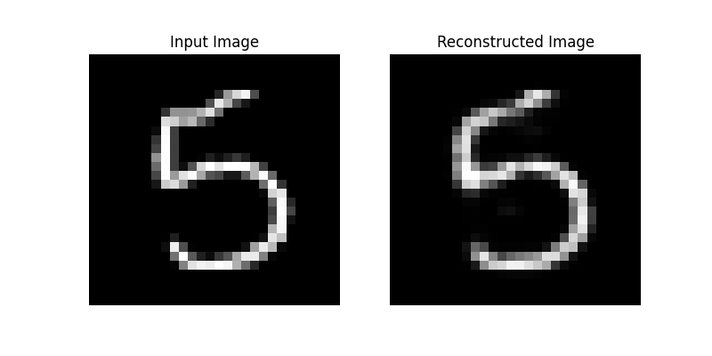
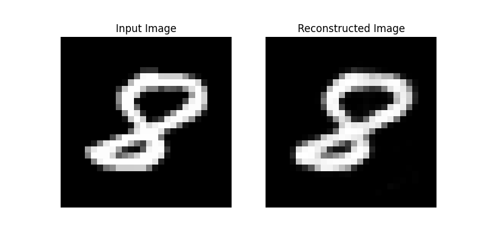
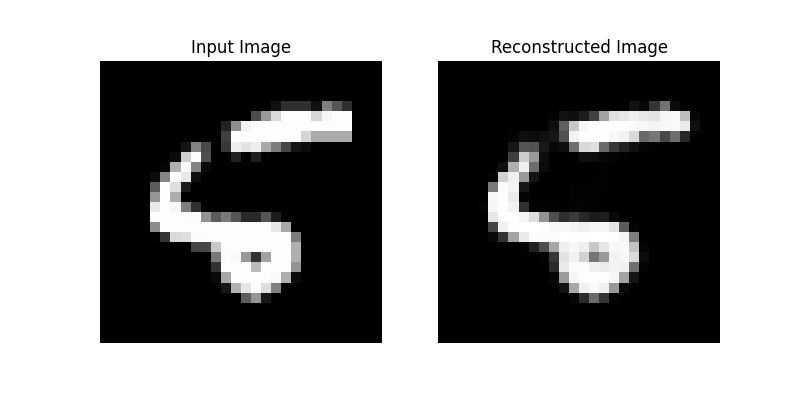
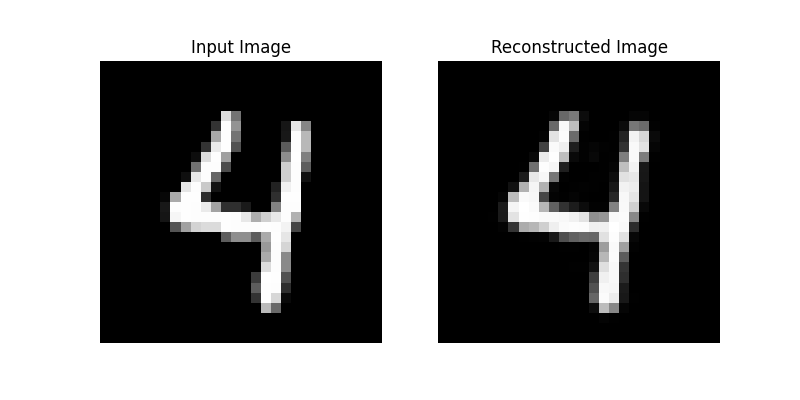
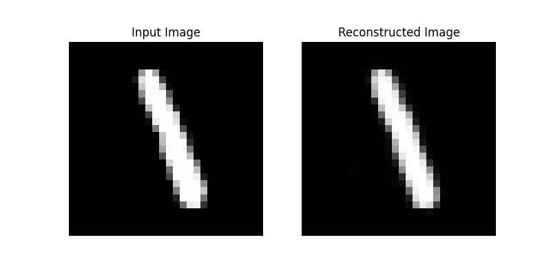

# Feedforward Autoencoder Implementation

This project implements a feedforward autoencoder for reconstructing images using PyTorch.

## Features
- Fully connected autoencoder for image reconstruction.
- Supports training and validation pipelines.
- Outputs visualizations of reconstructed images.

## References
This implementation is inspired by:
- [arXiv:2003.05991](https://arxiv.org/abs/2003.05991)
- [arXiv:2201.03898v1](https://arxiv.org/abs/2201.03898v1)

## Example Results
Here are some example reconstructions generated by the autoencoder:

| **Results**                    |
|--------------------------------|
|| 
||
||
||
||
||
||
||
||
||

